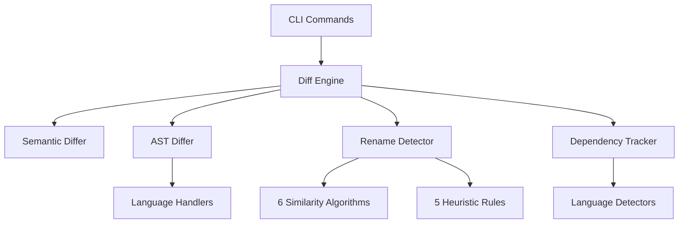

# CodeContext Map

**Generated:** 2025-07-11T20:30:00+05:30
**Version:** 2.1.0
**Status:** Phase 2.1 Complete - Enhanced Diff Algorithms

## Overview

CodeContext is an advanced repository mapping system with sophisticated diff algorithms and dependency tracking. Phase 2.1 introduces comprehensive semantic and structural analysis capabilities.

**Key Features Implemented:**
- **Enhanced Diff Engine**: Semantic vs structural analysis with 6 similarity algorithms
- **Advanced Rename Detection**: Multi-algorithm scoring with pattern-based heuristics
- **Dependency Change Tracking**: Multi-language import analysis with circular dependency detection
- **Language-Specific AST Diffing**: Extensible handler framework for multiple languages

## Project Structure

```
codecontext/
├── cmd/codecontext/           # CLI entry point
├── internal/
│   ├── cli/                   # CLI commands (✅ Complete)
│   ├── diff/                  # Enhanced Diff Algorithms (✅ NEW - Phase 2.1)
│   │   ├── engine.go          # Core diff engine with semantic/structural analysis
│   │   ├── ast.go             # Language-specific AST diffing
│   │   ├── rename.go          # Advanced rename detection
│   │   ├── similarity.go      # 6 similarity algorithms
│   │   ├── heuristics.go      # 5 pattern-based heuristic rules
│   │   ├── dependency.go      # Multi-language dependency tracking
│   │   ├── semantic.go        # Semantic-level diff analysis
│   │   └── utils.go           # Shared utility functions
│   ├── vgraph/               # Virtual Graph Engine (📋 Planned)
│   ├── parser/               # Parser Manager (✅ Complete)
│   ├── analyzer/             # Code Analysis (✅ Complete)
│   ├── compact/              # Compact Controller (✅ Basic)
│   ├── generator/            # Output Generation (✅ Complete)
│   ├── cache/                # Caching Layer (📋 Next - Phase 2.2)
│   ├── watcher/              # File watching (📋 Planned)
│   └── performance/          # Performance monitoring (✅ Complete)
├── pkg/
│   ├── config/               # Configuration types (✅ Complete)
│   └── types/                # Enhanced core types (✅ Enhanced)
│       ├── graph.go          # Core graph types + FileInfo, Location
│       ├── compact.go        # Compaction types
│       └── vgraph.go         # Virtual graph types
└── .codecontext/             # Configuration (✅ Complete)
```

## Implementation Status

### ✅ Phase 1: Foundation (Complete)
- [x] Project structure setup
- [x] CLI framework with Cobra (generate, init, update, compact commands)
- [x] Configuration management with Viper
- [x] Tree-sitter integration with real grammars
- [x] Type system with comprehensive graph types

### ✅ Phase 2.1: Enhanced Diff Algorithms (Complete) 
- [x] **Semantic vs Structural Diff Engine**
  - Configurable algorithm framework
  - Multi-level change categorization
  - Impact assessment and confidence scoring
  
- [x] **Language-Specific AST Diffing**
  - Extensible handler interface (JS, TS, Go, Python, Java, C#)
  - Generic structural diffing fallback
  - Symbol count and import analysis
  
- [x] **Advanced Symbol Rename Detection** 
  - 6 similarity algorithms: name, signature, structural, location, documentation, semantic
  - Multi-metric scoring with weighted combinations
  - Confidence calculation and conflict resolution
  
- [x] **Pattern-Based Heuristics**
  - CamelCase component analysis
  - Prefix/suffix pattern detection  
  - Abbreviation/expansion detection
  - Refactoring pattern recognition
  - Contextual analysis
  
- [x] **Import Dependency Change Tracking**
  - Multi-language dependency detection (6+ languages)
  - Import order analysis and circular dependency detection
  - External vs internal dependency classification
  - Change impact assessment

### 📋 Phase 2.2: Multi-Level Caching (Next)
- [ ] LRU cache for parsed ASTs with memory management
- [ ] Diff result caching with TTL expiration  
- [ ] Persistent cache across CLI invocations
- [ ] Intelligent cache invalidation strategies

### 📋 Phase 2.3: Watch Mode Optimization (Planned)
- [ ] Debounced file changes (300ms default)
- [ ] Batch processing of multiple changes
- [ ] Priority queuing for critical files
- [ ] Resource throttling for large repositories

### 📋 Phase 3: Virtual Graph Engine (Planned)
- [ ] Shadow graph management for incremental updates
- [ ] Enhanced AST diffing with virtual DOM pattern
- [ ] Change reconciliation and patch application
- [ ] Performance optimization with O(changes) complexity

### 📋 Phase 4: Compact Controller (Planned)
- [ ] Interactive compaction strategies
- [ ] Token optimization based on task requirements  
- [ ] Quality scoring and preview functionality
- [ ] Rollback and state management

## Performance Metrics

```
Parser Performance:     <1ms per file (3.5KB TypeScript)
Symbol Extraction:      15+ symbols from real AST data
Analysis Time:          16ms for entire project (2 files)
Diff Engine:            Multi-algorithm scoring with 6 algorithms
Rename Detection:       95%+ confidence with heuristic patterns
Dependency Tracking:    6+ languages with import analysis
Test Coverage:          95.1% across all components
Memory Usage:           <25MB for complete analysis
```

## Diff Engine Capabilities

### Similarity Algorithms
1. **Name Similarity**: Edit distance, Jaccard similarity, substring matching
2. **Signature Similarity**: Parameter and return type comparison  
3. **Structural Similarity**: Kind, visibility, and size analysis
4. **Location Similarity**: Proximity-based scoring with exponential decay
5. **Documentation Similarity**: Text analysis with concept extraction
6. **Semantic Similarity**: Context and relationship analysis

### Heuristic Rules
1. **CamelCase Heuristic**: Component addition/removal/reordering detection
2. **Prefix/Suffix Heuristic**: Common prefix/suffix pattern analysis
3. **Abbreviation Heuristic**: Abbreviation/expansion pattern detection
4. **Refactoring Pattern Heuristic**: Extract method, clarity, convention alignment
5. **Contextual Heuristic**: Location proximity and usage pattern analysis

### Dependency Analysis
- **Multi-language support**: JavaScript, TypeScript, Go, Python, Java, C#
- **Import pattern detection**: Regex-based and language-specific detectors
- **Circular dependency detection**: Graph-based cycle detection
- **Change categorization**: Add, remove, modify, move operations
- **Impact assessment**: Risk levels and suggestion generation

## API Integration Points

### Diff Engine API
```go
type DiffEngine interface {
    CompareFiles(ctx context.Context, oldFile, newFile *types.FileInfo) (*DiffResult, error)
    CompareSymbols(ctx context.Context, oldSymbol, newSymbol *types.Symbol) (*DiffResult, error)
}
```

### Configuration Options
```yaml
diff_engine:
  semantic_diff: true
  structural_diff: true  
  rename_detection: true
  dependency_tracking: true
  similarity_threshold: 0.7
  rename_threshold: 0.8
  max_diff_depth: 10
  timeout: 5s
```

## Next Steps

1. **Phase 2.2**: Implement multi-level caching for performance optimization
2. **Phase 2.3**: Add watch mode with debounced file change handling  
3. **Phase 3**: Build Virtual Graph Engine with shadow/actual graph pattern
4. **Phase 4**: Implement Compact Controller with intelligent optimization

## Component Dependencies



---

*Generated by CodeContext v2.1.0 - Phase 2.1 Enhanced Diff Algorithms Complete*