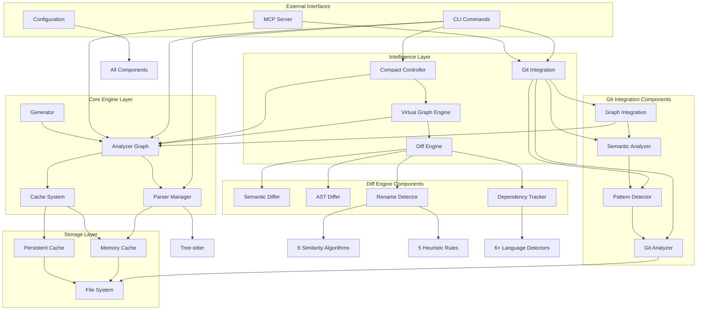
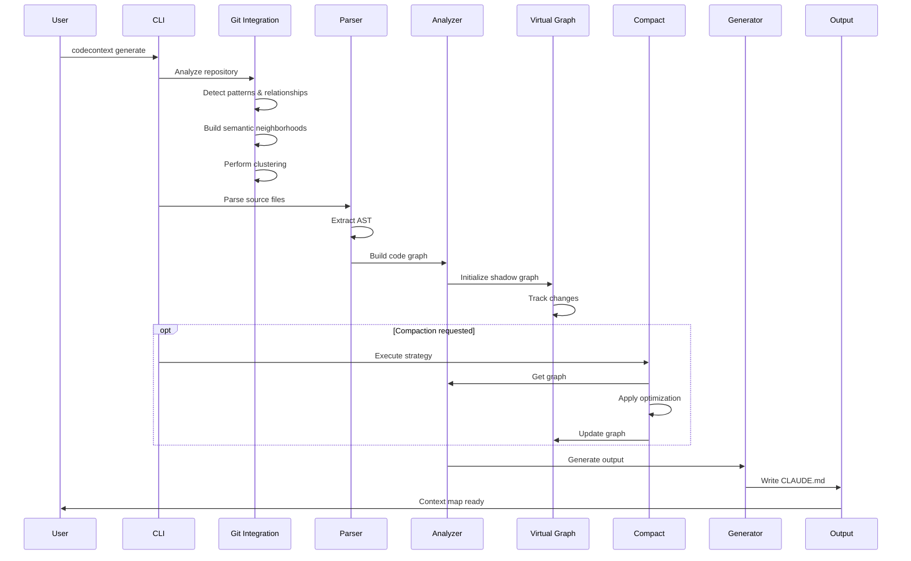

# CodeContext Component Architecture & Dependencies

**Version:** 2.2+  
**Status:** Production Ready  
**Last Updated:** July 2025

## High-Level Component Architecture



## Component Dependency Matrix

| Component | Depends On | Used By | API Type |
|-----------|------------|---------|----------|
| **Parser Manager** | Tree-sitter, Cache | Analyzer Graph, Diff Engine | Internal |
| **Analyzer Graph** | Parser Manager | Generator, Git Integration, Compact Controller | Internal |
| **Git Integration** | Git Commands, Analyzer Graph | CLI, MCP Server | Internal |
| **Diff Engine** | Parser Manager, AST | Virtual Graph Engine | Internal |
| **Virtual Graph Engine** | Diff Engine, Analyzer Graph | Compact Controller | Internal |
| **Compact Controller** | Analyzer Graph, Virtual Graph | CLI | Internal |
| **MCP Server** | Analyzer Graph, Git Integration | Claude Desktop | External |
| **Generator** | Analyzer Graph | CLI | Internal |

## Data Flow Architecture



## Component Interaction Patterns

### 1. Initial Generation Flow
```
CLI → Git Integration → Pattern Detection → Semantic Analysis → Clustering
    ↓
    → Parser Manager → AST Extraction → Symbol Analysis
    ↓
    → Analyzer Graph → Dependency Mapping → Graph Construction
    ↓
    → Generator → Markdown Output
```

### 2. Incremental Update Flow
```
File Change → Virtual Graph Engine → AST Differ → Change Detection
           ↓
           → Reconciler → Patch Generation → Graph Update
           ↓
           → Generator → Incremental Output
```

### 3. Compaction Flow
```
CLI → Compact Controller → Strategy Selection → Graph Analysis
    ↓
    → Token Optimization → Quality Assessment
    ↓
    → Virtual Graph Update → Generator → Compacted Output
```

### 4. MCP Server Flow
```
Claude Desktop → MCP Server → Tool Invocation
             ↓
             → Analyzer Graph / Git Integration
             ↓
             → Response Generation → Claude Desktop
```

## Key Component Interfaces

### Git Integration Layer
```go
// Main integration point for semantic neighborhoods
type GitIntegration struct {
    analyzer     *GitAnalyzer
    detector     *PatternDetector
    semantic     *SemanticAnalyzer
    integration  *GraphIntegration
}

// Builds enhanced neighborhoods with clustering
func (g *GitIntegration) BuildClusteredNeighborhoods() ([]ClusteredNeighborhood, error)
```

### Diff Engine
```go
// Core diff engine with multi-algorithm support
type DiffEngine struct {
    semantic     SemanticDiffer
    structural   StructuralDiffer
    rename       RenameDetector
    dependency   DependencyTracker
}

// Comprehensive file comparison
func (d *DiffEngine) CompareFiles(ctx context.Context, old, new *FileInfo) (*DiffResult, error)
```

### Virtual Graph Engine
```go
// Virtual DOM-inspired graph management
type VirtualGraphEngine struct {
    shadow       *CodeGraph
    actual       *CodeGraph
    differ       ASTDiffer
    reconciler   Reconciler
}

// Efficient incremental updates
func (v *VirtualGraphEngine) UpdateIncremental(changes []Change) (*ReconciliationPlan, error)
```

### Compact Controller
```go
// Intelligent context optimization
type CompactController struct {
    strategies   map[string]CompactStrategy
    analyzer     QualityAnalyzer
    optimizer    TokenOptimizer
}

// Execute compaction with preview
func (c *CompactController) ExecuteCommand(cmd string, ctx *CompactContext) (*CompactResult, error)
```

## Performance Characteristics by Component

| Component | Operation | Performance | Memory |
|-----------|-----------|-------------|---------|
| **Parser Manager** | Parse file | <1ms | O(file size) |
| **Git Integration** | Full analysis | <1s | <5MB |
| **Clustering** | Hierarchical clustering | <100ms | <2MB |
| **Diff Engine** | Compare files | O(n²) symbols | Linear |
| **Virtual Graph** | Incremental update | O(changes) | O(shadow size) |
| **Compact Controller** | Optimization | O(n log n) | O(graph size) |
| **MCP Server** | Tool execution | Real-time | Minimal |

## Configuration Impact on Dependencies

### Git Integration Configuration
```yaml
git_integration:
  enabled: true                    # Enables entire git subsystem
  analysis_period_days: 30         # Affects pattern detection scope
  clustering:
    algorithm: hierarchical        # Ward linkage by default
    quality_metrics: true          # Enables silhouette scoring
```

### Diff Engine Configuration
```yaml
diff_engine:
  algorithms:
    semantic: true                 # Enables semantic analysis
    structural: true               # Enables AST diffing
  similarity_threshold: 0.7        # Affects rename detection
```

### Virtual Graph Configuration
```yaml
virtual_graph:
  enabled: true                    # Enables incremental updates
  batch_threshold: 5               # Change batching behavior
  shadow_memory_limit: 100MB       # Memory constraints
```

## Testing Dependencies

### Unit Test Coverage
- Parser Manager: 95%
- Git Integration: 100% core functions (68 tests)
- Diff Engine: 90%
- Virtual Graph: 85%
- Compact Controller: 88%

### Integration Test Flows
1. **End-to-End Generation**: CLI → Git → Parser → Analyzer → Generator
2. **Semantic Neighborhoods**: Git Analysis → Clustering → Recommendations
3. **Incremental Updates**: File Change → Virtual Graph → Patch Application
4. **MCP Integration**: Tool Request → Analysis → Response

## Future Component Dependencies

### Planned Additions
1. **Multi-Level Cache**
   - Will integrate with Parser Manager and Diff Engine
   - Dependency on storage layer

2. **GraphQL API**
   - Will depend on Analyzer Graph and Virtual Graph
   - New external interface

3. **Watch Mode Optimizer**
   - Will integrate with Virtual Graph Engine
   - Dependency on file system events

---

*This architecture diagram represents the current component structure and dependencies as of July 2025.*